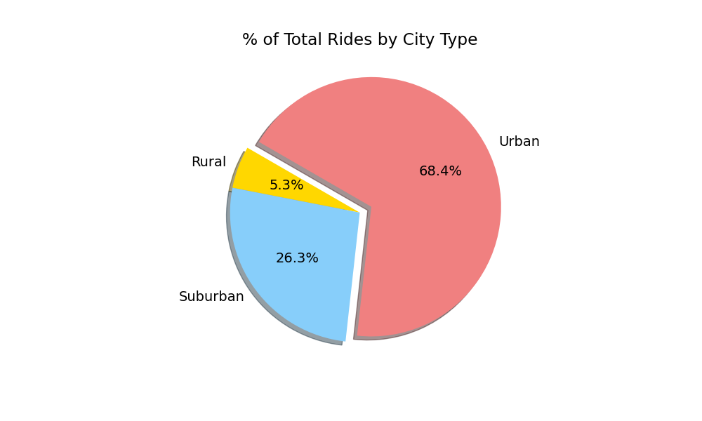

# PyBer Analysis
This is an analysis for a  ride sharing app to explore rideshare data and to help improve access to rideshare services and find a better priceing. We will use visualisation and Matplotlib liberary to better undrestand the data and convey the information.
## Overview of the analysis:
The data provides information for rides in each city. The ride information includes fare and date. Other information that are provided are type of the city and number of drivers that work in that city.
The first analysis to perform is to find number of rides in each type of city. The type of city can be Rural, Suburban or Urban. There were 1,625 rides in urban cities, 625 rides in suburban cities, and 125 rides in rural cities. Putting these data in a pie chart will results in:

The next study is performed on number of drivers for each city type. There were 2,405 driver for urban cities, 490 driver for suburban cities, and 78 driver for rural cities. Putting these data in a pie chart will results in:

Next analysis is to find the total amount of fare charged for each city type. There were an income of $39854.38 for urban cities, $19356.33 for suburban cities, and 4327.93 for rural cities.Putting these data in a pie chart will results in:

Using these data, average fare per ride and average fare per driver can be calculated. These results are shown in the following table:

The next step is to get deeper in the data and find the total fare by city type for specific date range, Jan 2019 to March 2019 and plot these information in weekly format. To show this data, first we need to confine our table to these specific dates then piviot our table to get information for each city type. Last step is to resample it using weekly format and plot it. This plot is shown in the following figure:

## Summary:
This was very in depth analysis for the data provided for each city type. These are the information that can be extracted from the above graphs

  - Urban cities uses the app the most and there are more drivers in urban cities. As a result, the majority of PyBer's revenue occurs in urban cities.
  - On the other hand, the costs for using PyBer is greater among riders in rural cities than urban cities. This could potentially discourage riders from using PyBer given the high average fare per ride.
  - Drivers in rural cities are earning more than drivers in urban cities. This could potentially discourage drivers from working with PyBer given the low average fare per driver.
